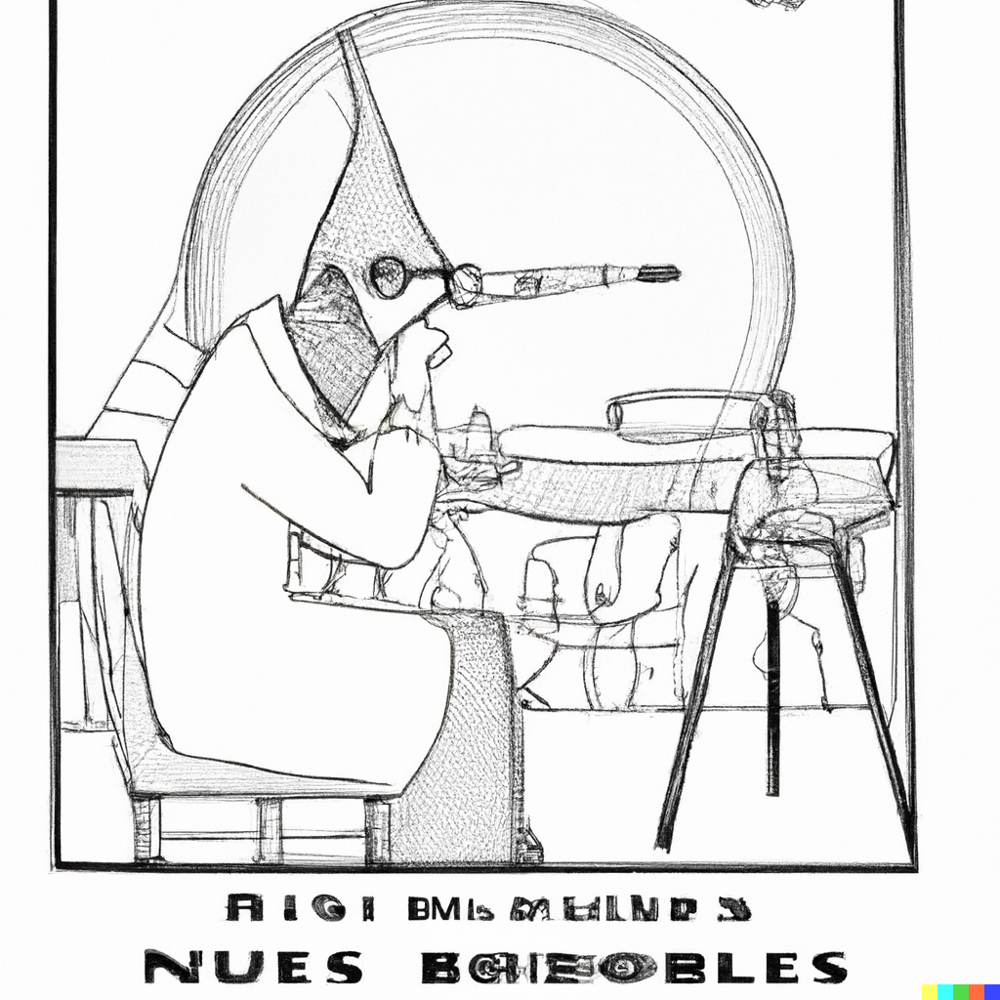
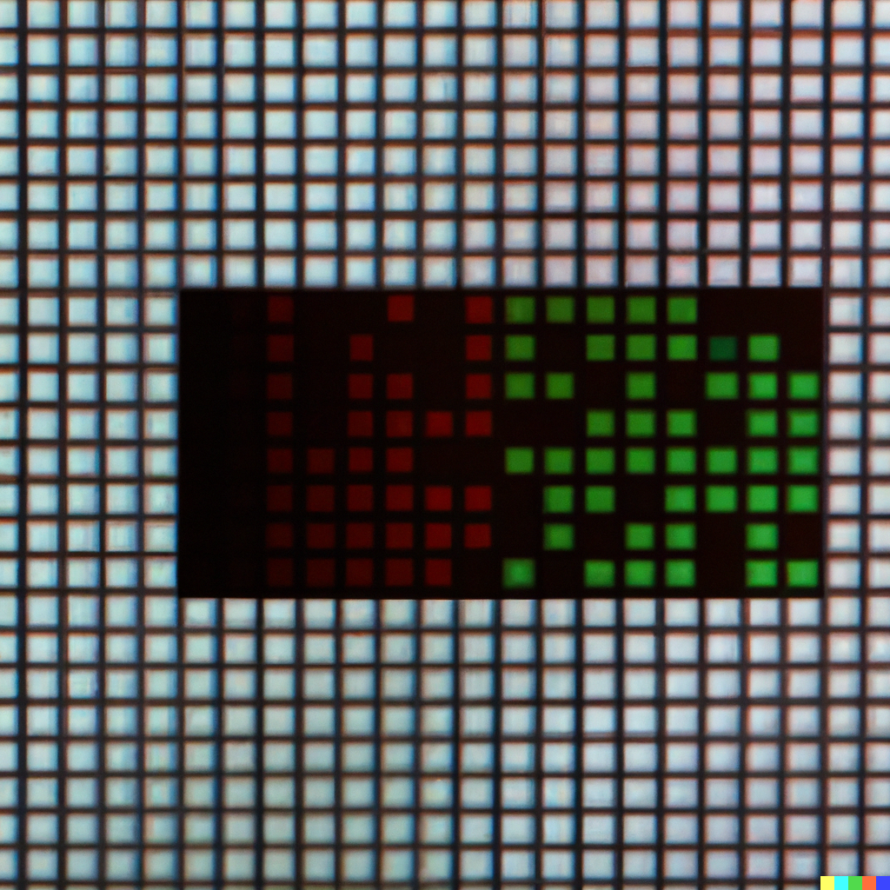

# Surprise Sylvie

Sylvie Leleu-Merviel est née avec une curiosité innée pour les médias et la communication, mais surtout avec un clavier d'ordinateur à la main (enfin, presque !).

{fig-alt="un bébé avec un clavier d'ordinateur à la main" fig-align="center"}

Dès son plus jeune âge, elle était fascinée par la manière dont les informations circulaient et étaient médiatisées. Ses premiers mots étaient probablement "Ctrl+Alt+Suppr".

Sa première incursion dans le monde de la recherche en 1986 ressemble presque à une scène de film de science-fiction. Imaginez une époque où les ordinateurs ressemblaient à des dinosaures et où les graphismes étaient à peu près aussi avancés que des dessins au crayon. C'est là que Sylvie a contribué à la modélisation de déformations pour l'animation en synthèse d'images. C'était comme si elle jonglait avec des pixels au milieu de l'âge de pierre numérique.

{fig-alt="une scène de film de science-fiction avec des dinosaures qui jongle avec des pixels"}

Au fil des années, son intérêt s'est élargi pour englober un éventail de sujets liés à la communication et aux médias. En 1992, elle a décidé de pimenter sa vie en travaillant sur l'habillage de surfaces bi-paramétriques à l'aide de textures planes. Oui, parce que qui n'a pas rêvé de mettre des textures planes sur des surfaces bi-paramétriques un jour ?

{fig-alt="dessin d'un rêve avec des textures planes sur des surfaces bi-paramétriques"}

Mais Sylvie ne s'est pas contentée de jouer avec des pixels. Au tournant du millénaire, elle a décidé de marier l'expérience de l'audiovisuel avec la rigueur de la qualité. C'était comme essayer de faire danser un robot avec grâce sur une piste de danse. Une tâche difficile, mais elle l'a fait avec style.

{fig-alt="faire danser un robot avec grâce sur une piste de danse" fig-align="center"}

Au fil des années, Sylvie a continué à repousser les limites de la communication numérique, explorant de nouvelles formes de narration et de médiation. Son travail sur la numérisation du récit a ouvert de nouvelles perspectives sur la manière dont les histoires sont racontées et partagées à l'ère numérique. Elle a fait des récits numériques une expérience aussi palpitante que de lire un livre avec une lampe de poche sous les couvertures la nuit.

{fig-alt="lire un livre avec une lampe de poche sous les couvertures la nuit" fig-align="center"}

En 2011, elle a décidé de s'attaquer aux JT français contemporains, montrant que même les nouvelles peuvent avoir un côté amusant, du moins lorsqu'on les regarde à travers le filtre de l'analyse critique.

{fig-alt="Un dessin amusant de Moebius qu'on regarde à travers le filtre de l'analyse critique"}

Mais peut-être que l'une des contributions les plus hilarantes de Sylvie à la recherche en communication a été son travail sur la médiation culturelle. Ses études sur l'accessibilité des musées et son visio-guide interactif ont ouvert la voie à de nouvelles façons d'appréhender la culture et le patrimoine à l'ère numérique.

{fig-alt="Diagramme visio-guide interactif" fig-align="center"}

Elle a rendu les visites au musée aussi passionnantes que de regarder un match de football, presque !

{fig-alt="musée d'un match de football"}

Tout au long de sa carrière, Sylvie Leleu-Merviel a continué à innover, à rire et à pousser les limites de la recherche en sciences de l'information et de la communication. Ses travaux ont été publiés dans des revues académiques de renom, et elle a réussi à prouver que même la recherche sérieuse peut avoir une touche d'humour.

{fig-alt="recherche sérieuse peut avoir une touche d'humour"}

Elle reste une source d'inspiration pour les chercheurs et les étudiants du monde entier, montrant que la recherche peut être à la fois sérieuse et amusante, tout comme une partie de cache-cache avec les pixels sur un écran d'ordinateur.

{fig-alt="une partie de cache-cache avec les pixels sur un écran d'ordinateur" fig-align="center"}